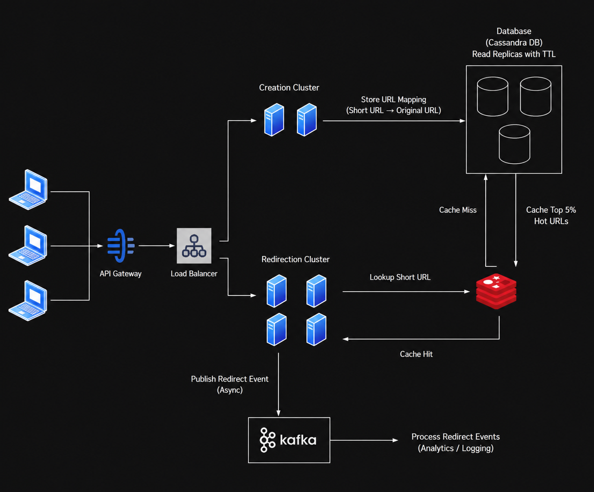

# Experiment 1 — High-Level Design of a URL Shortener (Bitly)

> **Course:** System Design  
> **Student:** Swaroop Kumar — 24BCS12717

---

## Objective

Design the **High-Level Design (HLD)** of a URL Shortener similar to **Bitly**. The system converts long URLs into short URLs and redirects users to the original URL efficiently while supporting caching, analytics, scalability, and fault tolerance.

---

## Functional Requirements

- Convert long URL to short URL
- Redirect to original URL
- Store URL mapping
- URL expiration (TTL)
- Analytics for URL redirects

---

## Non-Functional Requirements

- Scalability
- High Availability
- Low Latency (<100 ms)
- Durability
- Fault Tolerance
- Rate Limiting

---

## System Design Diagram



---

## Components

- **API Gateway** – Handles incoming requests and rate limiting.
- **Creation Cluster** – Generates unique short URLs using Base62 encoding.
- **Redirection Cluster** – Redirects users to the original URL.
- **Redis Cache** – Stores frequently accessed URLs for faster lookups.
- **Database (Cassandra)** – Stores URL mappings with replication.
- **Kafka** – Processes redirect events asynchronously.
- **Analytics** – Collects click statistics and usage data.

---

## Workflow

### URL Creation

```
User
   ↓
API Gateway
   ↓
Creation Cluster
   ↓
Base62 Encoding
   ↓
Database
```

### URL Redirection

```
User
   ↓
API Gateway
   ↓
Redirection Cluster
   ↓
Redis Cache

Cache Hit
   ↓
Redirect

Cache Miss
   ↓
Database
   ↓
Update Cache
   ↓
Redirect
```

### Analytics

```
Redirect Event
      ↓
Kafka
      ↓
Analytics Processing
```

---

## Technologies Used

- API Gateway
- Redis
- Cassandra
- Kafka
- Base62 Encoding

---

## Conclusion

The proposed architecture provides a scalable, highly available, and fault-tolerant URL Shortener capable of serving millions of requests with low latency. Redis caching and asynchronous event processing improve performance while Kafka enables efficient analytics collection.
